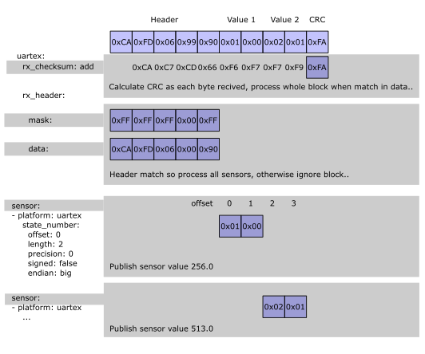

[](https://github.com/eigger/espcomponents/releases)
# Read and Parse UART Data in ESPHome


ESPHome has been able to send data to a device via the UART using the [ESPHome UART Bus component](https://esphome.io/components/uart.html). However, reading data sent back from the device has been complicated. This either involved creating a custom component (which is now [not possible](https://esphome.io/guides/contributing.html#a-note-about-custom-components)) or using a [hack in the debug logging system](https://community.home-assistant.io/t/how-to-uart-read-without-custom-component/491950).


This ESPHome external component makes it easy to read UART data from a device. It also allows for the data it to be filtered, extracted and formatted as ESPHome sensor values. It can optionally then send data back to the device.

You can include this ESPHome external component with the following:
```
external_components:
  - source: github://eigger/espcomponents/releases/latest
    components: [ uartex ]
    refresh: 1day
```

The component performs the following loop read/match/process/reply:

1) Read in bytes from a device via the UART until the end of data block is detected.
2) If the header matches, it then passes the block received to all the sensors that have been configured to process the data block.
3) If configured, it then sends bytes back to the device via the UART.

The end of a block is detected when any of the following occur:

1) If `rx_cheksum:` is specified, then a CRC is calculated after each byte is received and if it matches in the data then reading stops. This method is convenient but might be caught out by a false match in the data.
2) If `rx_length` is specified it will stop reading after the specified number of bytes have been read.
3) Or if `rx_timeout` has been reached it will stop and then process the block. While reading in the block this component will be blocking, this may cause warnings if the timeout is greater than 30mSec


For the read part of the loop this diagram shows the flow, this example uses the `rx_checksum` method to detect the end of a block of data:




# Base uartex set up

The read/match/process/reply loop is configured in the `uartex:` section of configuration.

```
# Example configuration entry
uartex:
  rx_timeout: 10ms
  tx_delay: 50ms
  tx_timeout: 500ms
  tx_retry_cnt: 3

  rx_header: [0x02, 0x01]
  rx_header_mask: [0xFF, 0xFF]

  rx_footer: [0x0D, 0x0A]
  tx_header: "\x02\x01"
  tx_footer: "\r\n"

  rx_checksum: add
  tx_checksum: add
```
<<<<<<< Updated upstream
### Configuration variables
- rx_timeout (Optional, Time): Data Receive Timeout. Defaults to 10ms. Max 2000ms
- rx_length (Optional, int): The length of the received data when the data length is fixed. Max 256
- tx_delay (Optional, Time): Data Send Delay. Defaults to 50ms. Max 2000ms
- tx_timeout (Optional, Time): ACK Reception Timeout. Defaults to 50ms. Max 2000ms
- tx_retry_cnt (Optional, int): Retry Count on ACK Failure. Defaults to 3. Max 10
- tx_ctrl_pin (Optional, gpio): Control PIN GPIO
- rx_header (Optional, array): Header of Data to be Received
- rx_footer (Optional, array): Footer of Data to be Received
- tx_header (Optional, array): Header of Data to be Transmitted
- tx_footer (Optional, array): Header of Data to be Transmitted
- rx_checksum (Optional, enum, lambda): Checksum of Data to be Received. (add, xor, add_no_header, xor_no_header)
  - uint8_t = (uint8_t* data, uint16_t len)
- tx_checksum (Optional, enum, lambda): Checksum of Data to be Transmitted. (add, xor, add_no_header, xor_no_header)
  - uint8_t = (uint8_t* data, uint16_t len)
- rx_checksum2 (Optional, enum or lambda): Checksum array of Data to be Received. (add, xor, add_no_header, xor_no_header)
  - vector\<uint8_t\> = (uint8_t* data, uint16_t len)
- tx_checksum2 (Optional, enum or lambda): Checksum array of Data to be Transmitted. (add, xor, add_no_header, xor_no_header)
  - vector\<uint8_t\> = (uint8_t* data, uint16_t len)
- on_read (Optional, lambda): Event of Data to be Received
  - void = (uint8_t* data, uint16_t len)
- on_write (Optional, lambda): Event of Data to be Transmitted
  - void = (uint8_t* data, uint16_t len)
- version (Optional): Version of Uartex
- error (Optional): Error of Uartex
- log (Optional): Log of Uartex
<hr/>
=======
>>>>>>> Stashed changes

## Configuration variables:

- **rx_timeout** *(Optional, [Time](https://esphome.io/guides/configuration-types#config-time))*: Data Receive Timeout. Defaults to 10ms. Max 2000ms
- **rx_length** *(Optional, int)*: The length of the received data, to use when the data length is fixed. Max 256

- **rx_checksum** *(Optional, enum, lambda)*: Checksum method for received data. Possible options are:
  - **add** - use additive CRC calculation
  - **xor** - use xor CRC calculation
  - **lambda** - you can specify your own CRC calculation, such as this:
    ```
    rx_checksum: !lambda |-
      uint32_t crc = 0x02 + 0x01;
      for (int i = 0; i < len; i++)
      {
        crc += data[i];           # data(0) is the first byte of data after the header.
      }
      return crc & 0x00FF;
    ```
  - uint8_t = (uint8_t* data, uint16_t len) :shrug:
- **rx_checksum2** *(Optional, enum or lambda)*: Checksum array of Data to be Received. (add, xor) :shrug:
  - vector\<uint8_t\> = (uint8_t* data, uint16_t len) :shrug:

- **rx_header** *(Optional, array)*: Header data required to match in data stream for processing to take place, if no match this data block is ignored.
- **rx_header_mask** *(Optional, array)*: Mask for received header data

- **rx_footer** *(Optional, array)*: Footer of Data to be Received

- **tx_delay** *(Optional, Time)* : Delay before data sent back to device. Defaults to 50ms. Max 2000ms
- **tx_timeout** *(Optional, Time)* : ACK Reception Timeout. Defaults to 50ms. Max 2000ms
- **tx_retry_cnt** *(Optional, int)* : Retry Count on ACK. Defaults to 3. Max 10
- **tx_ctrl_pin** *(Optional, gpio)* : Control PIN GPIO

- **tx_header** *(Optional, array)* : Header added to data to be sent.
- **tx_footer** *(Optional, array)* : Footer added to data to be sent.
- **tx_checksum** *(Optional, enum, lambda)* : Checksum added to data to be sent (add, xor)
  - uint8_t = (uint8_t* data, uint16_t len) :shrug:
- **tx_checksum2** *(Optional, enum or lambda)* : Checksum added to data to be sent (add, xor) :shrug:
  - vector\<uint8_t\> = (uint8_t* data, uint16_t len) :shrug:

- **on_read** *(Optional, lambda)* : Event when data block read
  - void = (uint8_t* data, uint16_t len) :shrug:
- **on_write** *(Optional, lambda)* : Event when data block sent
  - void = (uint8_t* data, uint16_t len) :shrug:
- **version** *(Optional)* : Creates a sensor to send version of this component to ESPHome
- **error** *(Optional)* : Creates a sensor to send error message from this component to ESPHome
- **log** *(Optional)* : Creates a sensor to send log message from this component to ESPHome


State Sensor
============

Not sure what this does !!!!!!! :shrug:
```
# Example configuration entry
state: 
  data: [0x01, 0x02] or "ascii string"
  mask: [0xff, 0xff] or "ascii string"
  offset: 0
  inverted: False
```
This would publish ??? to ESPHome when it receives:

| Data Rx   | 0x02 | 0x01 | 0x01 | 0x02 | 0x00 | CRC  | 0x0D | 0x0A  |
| -----     | :--: | :--: | :--: | :--: | :--: | :--: | :--: | :---: |
| Offset    | head | head | 0    | 1    | 2    | 3    | 4    | 5     |

## Configuration variables
- **data** *(Required, array or string)*: 
- **mask** *(Optional, array or string)*: Defaults to []
- **offset** *(Optional, int)*: Defaults to 0.
- **inverted** *(Optional, bool)*: Defaults to False.

Send a Command
==============

This sends a command to device and optionally checks for an acknowledgement (ACK) back.
```
# Example configuration entry
command: 
  cmd: [0x01, 0x02, 0x01]
  ack: [0xff]
```

This would send to the device via the UART the following data:
| header | 0x01 | 0x02 | 0x01 | CRC  | footer |
| :----: | :--: | :--: | :--: | :--: | :--:   |

And will expect back an ACK of:
| header | 0xff |  CRC  | footer  |
| :----: | :--: | :---: | :-----: | 

The test for the ACK will be influenced by `tx_delay:`, `tx_timeout:` and `x_retry_cnt:` specified in the `uartex:` section

## Configuration variables
- **cmd** *(Required, array or string)*: Command to be sent.
- **ack** *(Optional, array or string)*: ACK to be checked, defaults to [].


State Number
===========

This publishes to ESPHome a number taken from the data block.
```
# Example configuration entry
sensor:
  - platform: uartex
    state_num: 
    offset: 2
    length: 1
    precision: 0
    signed: false or true (default: true)
    endian: "big" or "little" (default: big)
    filters:
      - multiply: 0.035

value = 0x02 
```
<<<<<<< Updated upstream
### Configuration variables
- offset (Required, int): (0 ~ 128)
- length (Optional, int): Defaults to 1. (1 ~ 4)
- precision (Optional, int): Defaults to 0. (0 ~ 5)
- signed (Optional, bool): Defaults to True. (True, False)
- endian (Optional, enum): Defaults to "big". ("big", "little")
<hr/>
=======
Receiving this data will publish the value "2.0" to ESPHome:
>>>>>>> Stashed changes

| header | 0x00 | 0x01 | 0x02 | CRC  | footer |
| :----: | :--: | :--: | :--: | :--: | :--:   |

## Configuration variables
- **offset** *(Required, int)*: (0 ~ 128) Offset from start of data block, 0 is the first byte after the header.
- **length** *(Optional, int)*: Defaults to 1. (1 ~ 4) The number of bytes to consume.
- **precision** *(Optional, int): Defaults to 0. (0 ~ 5). The precision of data read or published :shrug:
- **signed** *(Optional, bool)*: Defaults to true. Sets the bytes to be processed as signed or unsigned.
- **endian** *(Optional, enum)*: Defaults to "big". Sets the endian for the bytes to be processed as big endian or little endian.

To Be Completed
===============

<!--
uartex.light
============
```
packet on) 0x02 0x01 0x02 0x03 0x01 (add)checksum 0x0D 0x0A
   offset) head head 0    1    2
packet on ack) 0x02 0x01 0x02 0x13 0x01 (add)checksum 0x0D 0x0A
packet off) 0x02 0x01 0x02 0x03 0x00 (add)checksum 0x0D 0x0A
packet off ack) 0x02 0x01 0x02 0x03 0x00 (add)checksum 0x0D 0x0A

light:
  - platform: uartex
    name: "Room 0 Light 1"
    id: room_0_light_1
    state: 
      data: [0x02, 0x03]
      mask: [0xff, 0x0f]
    state_on:
      offset: 2
      data: [0x01]
    state_off:
      offset: 2
      data: [0x00]
    command_on:
      data: [0x02, 0x03, 0x01]
      ack: [0x02, 0x13, 0x01]
    command_off: !lambda |-
      return {{0x02, 0x03, 0x00}, {0x02, 0x13, 0x00}};
```
### Configuration variables
- state (Optional, state): 
- state_on (Required, state): 
- state_off (Required, state): 
- state_brightness (Optional, lambda):
  - float = (uint8_t* data, uint16_t len)
- command_on (Required, command or lambda): 
  - command = (void)
- command_off (Required, command or lambda): 
  - command = (void)
- command_brightness (Optional, lambda): 
  - command = (float x)
- command_update (Optional, command or lambda): 
  - command = (void)
<hr/>

## uartex.binary_sensor
```
packet on) 0x02 0x01 0x02 0x03 0x01 (add)checksum 0x0D 0x0A
   offset) head head 0    1    2
packet off) 0x02 0x01 0x02 0x03 0x00 (add)checksum 0x0D 0x0A

binary_sensor:
  - platform: uartex
    name: Binary_Sensor1
    state: [0x02, 0x03]
    state_on:
      offset: 2
      data: [0x01]
    state_off:
      offset: 2
      data: [0x00]
```
### Configuration variables
- state (Optional, state): 
- state_on (Required, state): 
- state_off (Required, state): 
- command_update (Optional, command or lambda): 
  - command = (void)
<hr/>

## uartex.button
```
packet on) 0x02 0x01 0x02 0x03 0x01 (add)checksum 0x0D 0x0A
   offset) head head 0    1    2

button:
  - platform: uartex
    name: "Elevator Call"
    icon: "mdi:elevator"
    command_on: 
      data: [0x02, 0x03, 0x01]
```
### Configuration variables
- command_on (Required, command or lambda): 
  - command = (void)
<hr/>

## uartex.climate
```
packet off) 0x02 0x01 0x02 0x03 0x00 target current (add)checksum 0x0D 0x0A
    offset) head head 0    1    2    3      4
packet off ack) 0x02 0x01 0x02 0x13 0x00 target current (add)checksum 0x0D 0x0A
packet heat) 0x02 0x01 0x02 0x03 0x01 target current (add)checksum 0x0D 0x0A
packet heat ack) 0x02 0x01 0x02 0x13 0x01 target current (add)checksum 0x0D 0x0A

climate:
  - platform: uartex
    name: "Room 0 Heater"
    id: room_0_heater
    visual:
      min_temperature: 5 °C
      max_temperature: 30 °C
      temperature_step: 1 °C
    state: 
      data: [0x02, 0x03]
      mask: [0xff, 0x0f]
    state_temperature_current:
      offset: 4
      length: 1
      precision: 0
    state_temperature_target:
      offset: 3
      length: 1
      precision: 0
    state_off:
      offset: 2
      data: [0x00]
    state_heat:
      offset: 2
      data: [0x01]
    command_off:
      data: [0x02, 0x03, 0x00]
      ack: [0x02, 0x13, 0x00]
    command_heat: !lambda |-
      float target = id(room_0_heater).target_temperature;
      return {{0x02, 0x03, 0x01, (uint8_t)target, 0x00},{0x02, 0x13, 0x01}};
    command_temperature: !lambda |-
      // @param: const float x
      float target = x;
      return {{0x02, 0x03, 0x01, (uint8_t)target, 0x00},{0x02, 0x13, 0x01}};
```
### Configuration variables
- state (Optional, state): 
- state_off (Required, state): 
- state_temperature_current (Optional, state_num or lambda):
  - float = (uint8_t* data, uint16_t len)
- state_temperature_target (Optional, state_num or lambda):
  - float = (uint8_t* data, uint16_t len)
- state_humidity_current (Optional, state_num or lambda):
  - float = (uint8_t* data, uint16_t len)
- state_humidity_target (Optional, state_num or lambda):
  - float = (uint8_t* data, uint16_t len)
- state_cool (Optional, state): 
- state_heat (Optional, state): 
- state_fan_only (Optional, state): 
- state_dry (Optional, state): 
- state_auto (Optional, state): 
- state_swing_off (Optional, state): 
- state_swing_both (Optional, state): 
- state_swing_vertical (Optional, state): 
- state_swing_horizontal (Optional, state): 
- state_fan_on (Optional, state): 
- state_fan_off (Optional, state): 
- state_fan_auto (Optional, state): 
- state_fan_low (Optional, state): 
- state_fan_medium (Optional, state): 
- state_fan_high (Optional, state): 
- state_fan_middle (Optional, state): 
- state_fan_focus (Optional, state): 
- state_fan_diffuse (Optional, state): 
- state_fan_quiet (Optional, state): 
- state_preset_none (Optional, state): 
- state_preset_home (Optional, state): 
- state_preset_away (Optional, state): 
- state_preset_boost (Optional, state): 
- state_preset_comfort (Optional, state): 
- state_preset_eco (Optional, state): 
- state_preset_sleep (Optional, state): 
- state_preset_activity (Optional, state): 
- state_custom_fan (Optional, lambda): 
  - std::string = (uint8_t* data, uint16_t len)
- state_custom_preset (Optional, lambda): 
  - std::string = (uint8_t* data, uint16_t len)
- command_off (Optional, command or lambda): 
  - command = (void)
- command_temperature (Optional, lambda): 
  - command = (float x)
- command_humidity (Optional, lambda): 
  - command = (float x)
- command_cool (Optional, command or lambda): 
  - command = (void)
- command_heat (Optional, command or lambda): 
  - command = (void)
- command_fan_only (Optional, command or lambda): 
  - command = (void)
- command_dry (Optional, command or lambda): 
  - command = (void)
- command_auto (Optional, command or lambda): 
  - command = (void)
- command_swing_off (Optional, command or lambda): 
  - command = (void)
- command_swing_both (Optional, command or lambda): 
  - command = (void)
- command_swing_vertical (Optional, command or lambda): 
  - command = (void)
- command_swing_horizontal (Optional, command or lambda): 
  - command = (void)
- command_fan_on (Optional, command or lambda): 
  - command = (void)
- command_fan_off (Optional, command or lambda): 
  - command = (void)
- command_fan_auto (Optional, command or lambda): 
  - command = (void)
- command_fan_low (Optional, command or lambda): 
  - command = (void)
- command_fan_medium (Optional, command or lambda): 
  - command = (void)
- command_fan_high (Optional, command or lambda): 
  - command = (void)
- command_fan_middle (Optional, command or lambda): 
  - command = (void)
- command_fan_focus (Optional, command or lambda): 
  - command = (void)
- command_fan_diffuse (Optional, command or lambda): 
  - command = (void)
- command_fan_quiet (Optional, command or lambda): 
  - command = (void)
- command_preset_none (Optional, command or lambda): 
  - command = (void)
- command_preset_away (Optional, command or lambda): 
  - command = (void)
- command_preset_boost (Optional, command or lambda): 
  - command = (void)
- command_preset_comfort (Optional, command or lambda): 
  - command = (void)
- command_preset_eco (Optional, command or lambda): 
  - command = (void)
- command_preset_sleep (Optional, command or lambda): 
  - command = (void)
- command_preset_activity (Optional, command or lambda): 
  - command = (void)
- command_update (Optional, command or lambda): 
  - command = (void)
- command_custom_fan (Required, lambda): 
  - command = (std::string str)
- command_custom_preset (Required, lambda): 
  - command = (std::string str)
- custom_fan_mode (Optional, list): A list of custom fan mode for this climate
- custom_preset (Optional, list): A list of custom preset mode for this climate
<hr/>

## uartex.fan
```
packet off) 0x02 0x01 0x02 0x03 0x00 speed (add)checksum 0x0D 0x0A
    offset) head head 0    1    2    3
packet off ack) 0x02 0x01 0x02 0x13 0x00 speed (add)checksum 0x0D 0x0A
packet on) 0x02 0x01 0x02 0x03 0x01 speed (add)checksum 0x0D 0x0A
packet on ack) 0x02 0x01 0x02 0x13 0x01 speed (add)checksum 0x0D 0x0A

fan:
  - platform: uartex
    name: "Fan1"
    state:
      data: [0x02, 0x03]
      mask: [0xff, 0x0f]
    state_on:
      offset: 2
      data: [0x01]
    state_off:
      offset: 2
      data: [0x00]
    command_on:
      data: [0x02, 0x03, 0x01]
      ack: [0x02, 0x13]
    command_off:
      data: [0x02, 0x03, 0x00]
      ack: [0x02, 0x13]
    command_speed: !lambda |-
      // @param: const float x
      return {
                {0x02, 0x03, 0x01, (uint8_t)x},
                {0x02, 0x13}
              };
    state_speed: !lambda |-
      // @param: const uint8_t *data, const unsigned short len
      // @return: const float
      {
        return data[3];
      }
```
### Configuration variables
- state (Optional, state): 
- state_on (Required, state): 
- state_off (Required, state): 
- state_speed (Optional, lambda):
  - float = (uint8_t* data, uint16_t len)
- state_preset (Optional, lambda): 
  - std::string = (uint8_t* data, uint16_t len)
- command_on (Required, command or lambda): 
  - command = (void)
- command_off (Required, command or lambda): 
  - command = (void)
- command_speed (Optional, lambda): 
  - command = (float x)
- command_preset (Required, lambda): 
  - command = (std::string str)
- command_update (Optional, command or lambda): 
  - command = (void)
- preset_modes (Optional, list): A list of preset modes for this fan
<hr/>

## uartex.lock
```
packet unlock) 0x02 0x01 0x02 0x03 0x00 (add)checksum 0x0D 0x0A
       offset) head head 0    1    2
packet unlock ack) 0x02 0x01 0x02 0x13 0x00 (add)checksum 0x0D 0x0A
packet lock) 0x02 0x01 0x02 0x03 0x01 (add)checksum 0x0D 0x0A
packet lock ack) 0x02 0x01 0x02 0x13 0x01 (add)checksum 0x0D 0x0A

lock:
  - platform: uartex
    name: "Lock1"
    state:
      data: [0x02, 0x03]
      mask: [0xff, 0x0f]
    state_locked:
      offset: 2
      data: [0x01]
    state_unlocked:
      offset: 2
      data: [0x00]
    state_locking:
      offset: 2
      data: [0x02]
    state_unlocking:
      offset: 2
      data: [0x03]
    state_jammed:
      offset: 2
      data: [0x04]
    command_lock:
      data: [0x02, 0x03, 0x01]
      ack: [0x02, 0x13]
    command_unlock:
      data: [0x02, 0x03, 0x00]
      ack: [0x02, 0x13]
```
### Configuration variables
- state (Optional, state): 
- state_locked (Optional, state): 
- state_unlocked (Optional, state): 
- state_locking (Optional, state): 
- state_unlocking (Optional, state): 
- state_jammed (Optional, state): 
- command_lock (Optional, command or lambda): 
  - command = (void)
- command_unlock (Optional, command or lambda): 
  - command = (void)
<hr/>

## uartex.number
```
packet) 0x02 0x01 0x02 0x03 0x00 number (add)checksum 0x0D 0x0A
offset) head head 0    1    2    3
packet ack) 0x02 0x01 0x02 0x13 0x00 number (add)checksum 0x0D 0x0A

number:
  - platform: uartex
    name: "Number1"
    state:
      data: [0x02, 0x03]
      mask: [0xff, 0x0f]
    max_value: 10
    min_value: 1
    step: 1
    state_number:
      offset: 3
      length: 1
      precision: 0
    command_number: !lambda |-
      // @param: const float x
      return {
                {0x02, 0x03, 0x00, (uint8_t)x},
                {0x02, 0x13}
              };
```
### Configuration variables
- state (Optional, state): 
- state_number (Optional, state_num or lambda):
  - float = (uint8_t* data, uint16_t len)
- command_number (Optional, lambda): 
  - command = (float x)
- command_update (Optional, command or lambda): 
  - command = (void)
<hr/>

## uartex.sensor
```
packet) 0x02 0x01 0x02 0x03 0x00 value (add)checksum 0x0D 0x0A
offset) head head 0    1    2    3
sensor:
  - platform: uartex
    name: Sensor1
    state: [0x02, 0x03, 0x00]
    state_number:
      offset: 3
      length: 1
      precision: 0
```
### Configuration variables
- state (Optional, state): 
- state_number (Optional, state_num or lambda): 
  - float = (uint8_t* data, uint16_t len)
- lambda (Optional, lambda): 
  - float = (uint8_t* data, uint16_t len)
- command_update (Optional, command or lambda): 
  - command = (void)
<hr/>

## uartex.switch
```
packet on) 0x02 0x01 0x02 0x03 0x01 (add)checksum 0x0D 0x0A
   offset) head head 0    1    2
packet on ack) 0x02 0x01 0x02 0x13 0x01 (add)checksum 0x0D 0x0A
packet off) 0x02 0x01 0x02 0x03 0x00 (add)checksum 0x0D 0x0A
packet off ack) 0x02 0x01 0x02 0x03 0x00 (add)checksum 0x0D 0x0A

switch:
  - platform: uartex
    name: "Switch1"
    state: 
      data: [0x02, 0x03]
      mask: [0xff, 0x0f]
    state_on:
      offset: 2
      data: [0x01]
    state_off:
      offset: 2
      data: [0x00]
    command_on:
      data: [0x02, 0x03, 0x01]
      ack: [0x02, 0x13, 0x01]
    command_off: !lambda |-
      return {{0x02, 0x03, 0x00}, {0x02, 0x13, 0x00}};
```
### Configuration variables
- state (Optional, state): 
- state_on (Required, state): 
- state_off (Required, state): 
- command_on (Required, command or lambda): 
  - command = (void)
- command_off (Required, command or lambda): 
  - command = (void)
- command_update (Optional, command or lambda): 
  - command = (void)
<hr/>

## uartex.text
```
text:
  - platform: uartex
    name: "Text"
    command_text: !lambda |-
      return {
                {0x0F, 0x01, 0x01},
                {0x0F, 0x01}
              };
```
### Configuration variables
- command_text (Required, lambda): 
  - command = (std::string str)
<hr/>

## uartex.text_sensor
```
packet on) 0x02 0x01 0x02 0x03 0x01 (add)checksum 0x0D 0x0A
   offset) head head 0    1    2
packet off) 0x02 0x01 0x02 0x03 0x00 (add)checksum 0x0D 0x0A

text_sensor:
  - platform: uartex
    name: "Text Sensor"
    state: [0x02, 0x03]
    lambda: |-
      {
        if (data[2] == 0x01) return "ON";
        else return "OFF";
      }
```
### Configuration variables
- state (Optional, state): 
- lambda (Optional, lambda): 
  - std::string = (uint8_t* data, uint16_t len)
- command_update (Optional, command or lambda): 
  - command = (void)
<hr/>

## uartex.valve
```
packet open) 0x02 0x01 0x02 0x03 0x01 (add)checksum 0x0D 0x0A
offset) head head 0    1    2    3
packet open ack) 0x02 0x01 0x02 0x13 0x01 (add)checksum 0x0D 0x0A
packet close) 0x02 0x01 0x02 0x03 0x00 (add)checksum 0x0D 0x0A
packet close ack) 0x02 0x01 0x02 0x03 0x00 (add)checksum 0x0D 0x0A

valve:
  - platform: uartex
    name: "Valve1"
    state: 
      data: [0x02, 0x03]
      mask: [0xff, 0x0f]
    state_open:
      offset: 2
      data: [0x01]
    state_closed:
      offset: 2
      data: [0x00]
    command_open:
      data: [0x02, 0x03, 0x01]
      ack: [0x02, 0x13, 0x01]
    command_close:
      data: [0x02, 0x03, 0x00]
      ack: [0x02, 0x13, 0x00]
```
### Configuration variables
- state (Optional, state): 
- state_open (Optional, state): 
- state_closed (Optional, state): 
- state_position (Optional, lambda):
  - float = (uint8_t* data, uint16_t len)
- command_open (Optional, command or lambda): 
  - command = (void)
- command_close (Optional, command or lambda): 
  - command = (void)
- command_stop (Optional, command or lambda): 
  - command = (void)
- command_update (Optional, command or lambda): 
  - command = (void)
<hr/>
-->

The end.